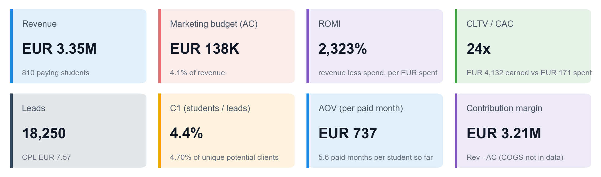
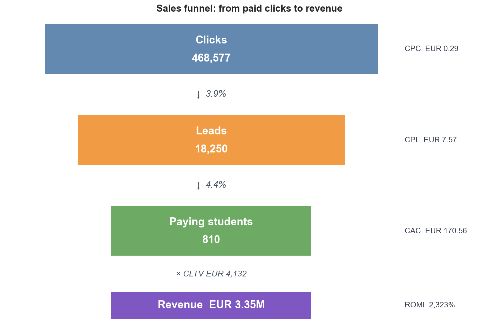
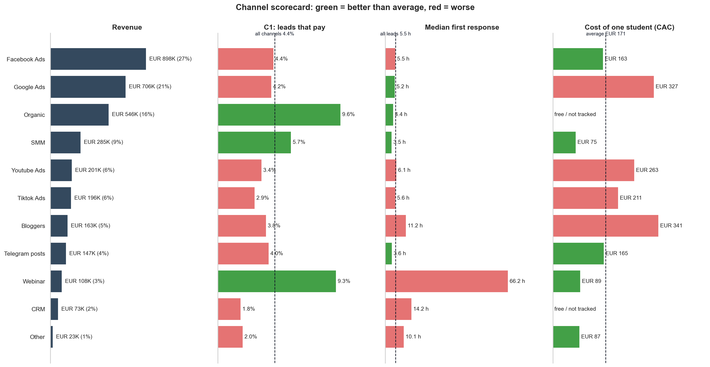
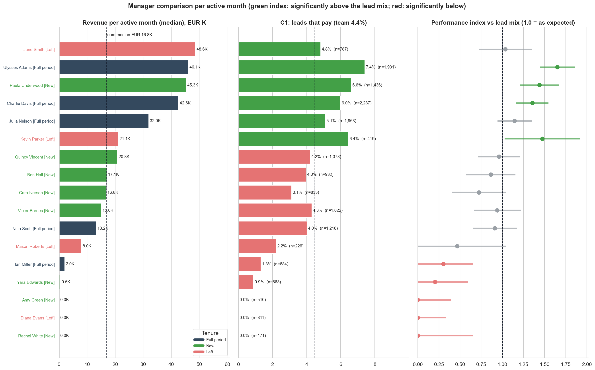
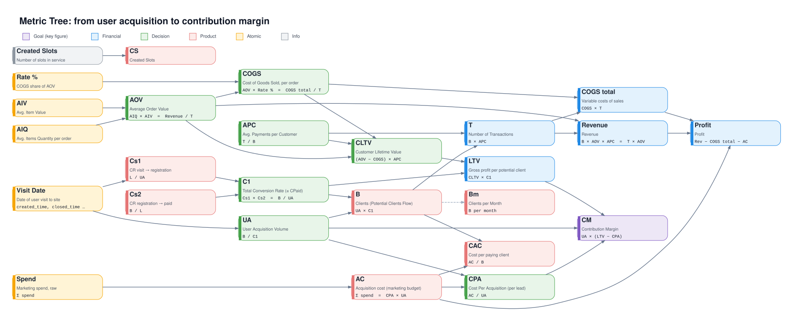
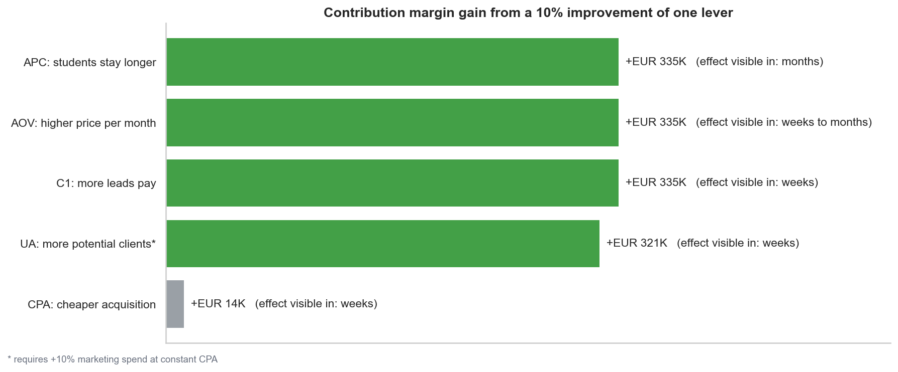
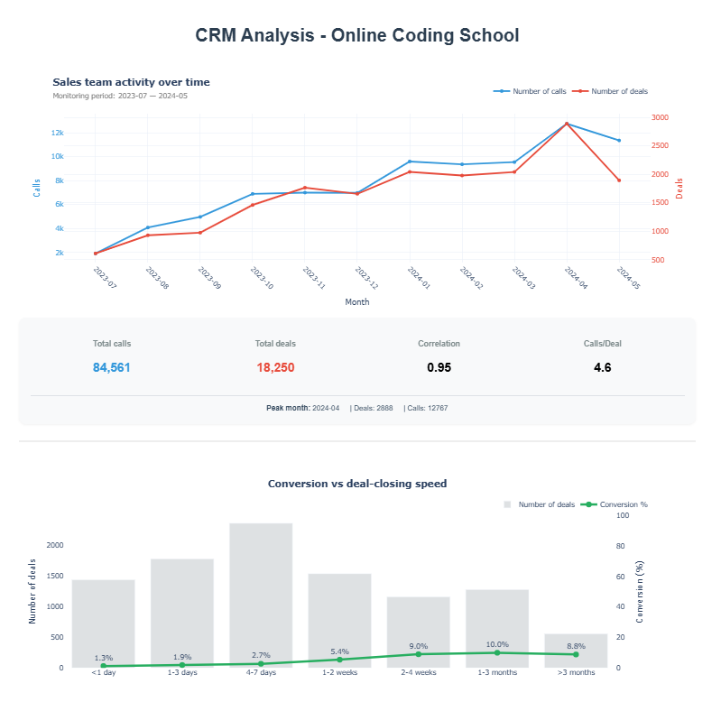

# CRM Funnel Analysis: unit economics, channels, sales team and a testable growth hypothesis

End-to-end analytics project on CRM data of an online IT school (July 2023 - May 2024): data preparation, marketing and sales analytics, unit economics with a metrics tree, and a growth hypothesis with an A/B test design.

**Business question:** where does the money come from, where does the funnel leak, and what is the fastest lever to grow margin?

## Key results

| Metric | Value |
| :--- | ---: |
| Revenue | EUR 3.35M |
| Marketing budget | EUR 138K (4.1% of revenue) |
| ROMI | 2,323% |
| Leads / paying students | 18,250 / 810 |
| Paying students per lead (C1) | 4.4% |
| CAC (cost of a paying student) | EUR 171 |
| CLTV (revenue per student, accumulated to date) | EUR 4,132 |
| **CLTV / CAC** | **24x** |



### What the analysis shows

1. **Unit economics are strong, so the growth lever is not cheaper traffic.** Marketing is 4.1% of revenue: a 10% cheaper acquisition adds about EUR 14K of margin, a 10% higher lead-to-student conversion adds about EUR 335K.
2. **Conversion is the weak spot and differs widely by channel.** The same product converts at 1.8% for the CRM base and at 9.6% for Organic.
3. **Google Ads is the most expensive channel:** 38.5% of the budget, 21% of revenue, EUR 327 per student against EUR 163 for Facebook Ads.
4. **First response is slow:** the median time to the first call is 5.5 hours, and only 19% of closed deals were contacted within an hour. Faster calls go together with better conversion (observational, tested in the experiment design).
5. **The sales team is uneven:** the top 4 managers bring 59% of revenue; 9 managers with no sales hold 8.8% of all leads. Managers are compared per active month and adjusted for the channel mix of their leads.

6. **Lead quality is falling while volume grows:** between Aug-Nov 2023 and Dec 2023-Mar 2024 the number of leads rose 50%, but the share of leads rated A-C dropped from 38.8% to 25.8% (about 20% in Feb-May 2024), while conversion held (5.4% to 5.0%).







## Metrics tree

The model decomposes contribution margin (CM) into the levers the business can influence. Colors show the role of a metric: goal, financial, decision, product, atomic data, info.



`CM = UA x (LTV - CPA)`, `LTV = CLTV x C1`, `CLTV = AOV x APC`. COGS is not available in the data and is set to 0, so CLTV and CM are revenue-based upper bounds.

## Growth hypothesis and test design

**Lever:** conversion of leads into paying students (C1). It is worth the same as price or course duration in margin terms, but reacts in weeks and needs no extra ad budget.

**Hypothesis (H1):** contacting a new lead within 30 minutes (instead of the current median of 5.5 hours) increases the share of qualified leads.

| Element | Design |
| :--- | :--- |
| Unit and randomization | New lead, 50/50 at creation |
| Exposure | 14 days, about 380 leads per arm on all incoming leads |
| Primary metric | Share of leads rated A-C by managers (minimum detectable effect 9.5 percentage points) |
| Guardrails | Calls per lead, manager workload, compliance with the 30-minute rule |
| Confirmation | Payments on the same cohorts at day 45-60 (median time to payment is 17.5 days) |

A payment-based decision within 14 days is not possible: detecting +25% of C1 needs about 5,700 leads per arm, roughly 30 weeks of the incoming flow. The design therefore uses a leading indicator and confirms payments afterwards.

**Size of the prize:** +1% relative C1 is worth about EUR 33K of margin at constant spend; +15% is about 120 extra students and EUR 0.5M (upper bound).



## Repository structure

```
crm-funnel-analysis/
├── notebooks/
│   ├── 01_data_prepare_calls.ipynb       # cleaning: calls
│   ├── 01_data_prepare_contacts.ipynb    # cleaning: contacts
│   ├── 01_data_prepare_deals.ipynb       # cleaning: deals (leads and sales)
│   ├── 01_data_prepare_spend.ipynb       # cleaning: marketing spend
│   ├── 02_crm_data_analytics.ipynb       # marketing and sales analytics (EDA, channels, SLA, managers)
│   ├── 03_crm_product_analytics.ipynb    # unit economics, metrics tree, hypothesis, A/B test design
│   └── 04_crm_business_insights.ipynb    # business summary: key findings in charts
├── src/
│   └── helpers.py                        # shared EDA helper functions
├── assets/                               # charts used in this README, metrics tree, dashboard screenshot
├── .gitignore               # excludes data/ (raw + processed .pkl) — regenerated by running 01_*
└── README.md
```
Intermediate datasets (data/processed/*.pkl) are not stored in the repository—they are generated when the 01_data_prepare_* notebooks are run, which ensures the reproducibility of the pipeline, rather than sending static data dumps.

## Notebooks

| Notebook | What it answers |
| :--- | :--- |
| **04 Business insights** | Start here: the business in one page, channels, speed of response, monthly dynamics, managers, levers |
| 03 Product analytics | Unit economics by product, metrics tree, growth points, hypothesis, test design and decision rule |
| 02 CRM data analytics | Data audit, funnel, marketing efficiency by campaign and source, SLA and lead quality, managers |
| 01 Data preparation | Cleaning of the four source tables and the common reporting period |

## Method notes

- **Common period:** all datasets are cut to 2023-07-01 - 2024-05-31.
- **Paying student:** unique student with stage "Payment Done" and months of study above zero (810). The student key is `contact_id`; 8 paid deals have no `contact_id` and are counted as separate students (key = deal id). **Transactions (T)** are paid months (4,540); **AOV** = revenue / T (EUR 737 per paid month); **APC** = T / B (5.66).
- **Two conversion rates:** C1 of the metrics tree = students / unique potential clients (4.65%); channel and manager tables use students / leads (4.4%), because channel and manager are stored on the deal.
- **Managers:** a manager is active in a month with at least 10 leads; metrics are per active month. The performance index is actual sales divided by the sales expected from the channel mix of the manager's leads, with a 95% interval.
- **Months studied so far:** `months_of_study` falls from 9.7 (leads of August 2023) to 1.9 (leads of May 2024) at a course length of 10-11 months, so revenue, T and APC of recent cohorts are still accumulating and CLTV is a lower bound.
- **Limitations:** no COGS in the data; the effect of response time is observational until the experiment is run; revenue in monthly charts is attributed to the month the lead was created, so the latest months are still maturing.

## Tech stack

Python, pandas, NumPy, Matplotlib, Seaborn, SciPy, Jupyter. The interactive dashboard (Dash) is shown as a screenshot, because it cannot be rendered on GitHub.



## How to run

```bash
git clone https://github.com/<your-user>/crm-funnel-analysis.git
cd crm-funnel-analysis
pip install -r requirements.txt
```

About the Data

The raw data is not published. Place the source files in `data/raw/`, then run the notebooks in order: `01_*` (creates `data/processed/*.pkl`), then `02`, `03`, `04`. Notebook 04 saves its charts to `assets/`.

This dataset consists of anonymized/synthetic training data used for a project as part of a data analysis course, not actual production data from a real company. The names of managers and clients, transaction amounts, and identifiers do not correspond to real individuals.
